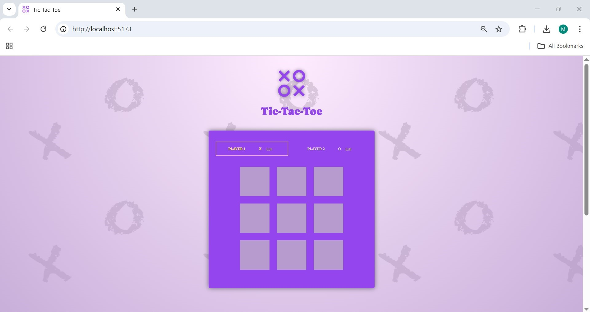

# 🎮 Tic-Tac-Toe

## 📌 Description

Tic-Tac-Toe is a classic web-based game built using React. It allows two players to take turns placing their marks (X and O) on a 3×3 grid. The app includes a simple and clean interface with the ability to change player names and restart the game when there's a winner or a draw. In addition, the app keeps a log of every move made by each player during the game, allowing users to track the progress of the match step by step.

## ✨ Features

- 👤 Change player names  
- ❌⭕ Turn-based gameplay for two players  
- 📜 Logs every move made by the players
- 🏆 Automatically detects winner or draw  
- 🔄 Rematch button appears after game ends  
- 🎯 Simple and intuitive UI  

## 🛠️ Technologies Used

- **Frontend:** React.js  
- **Styling:** Vanilla CSS  
- **Backend:** None
- **Data Storage:** None  

---

💡 Created with ❤️ by [marsel](https://github.com/marsellius88)
